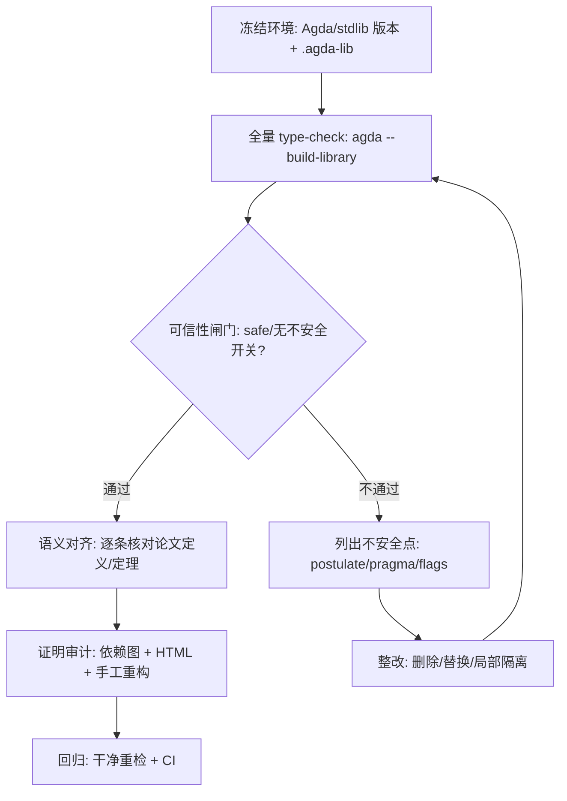
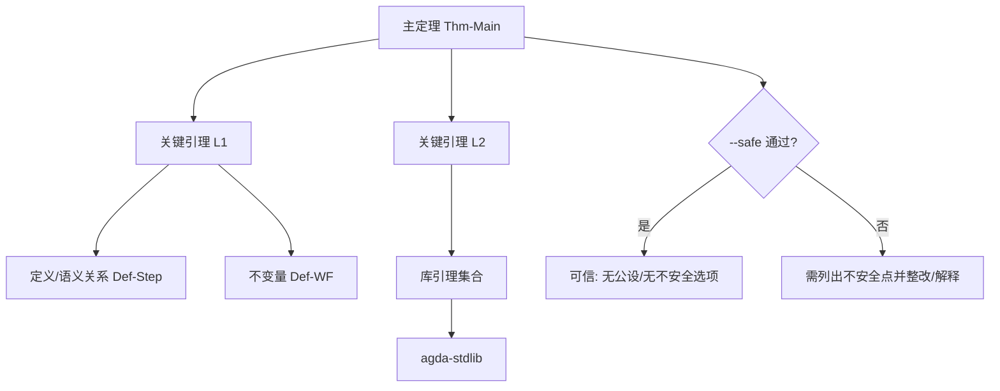

# 审阅 AI 生成的 Agda 机械化代码：面向 Functional Pearl 投稿的资深审查协议

## 执行摘要

你现在的处境（Agda 代码 **完全由 Claude Opus 4.6 生成、且尚未人审**）在资深 PL 审稿人眼里，核心风险不是“会不会跑”，而是“**到底证明了什么**、以及**证明是否建立在可接受的可信基底（TCB）上**”。尤其当论文文本宣称“无公设（postulate-free）”或“健全性/进展”等关键元理论性质时，审稿人会默认你能给出 **可复现构建**、**零不安全开关**、**无漏洞式捷径** 的证据链。你给的稿件 PDF 就明确提到配套 Agda 机械化与“postulate-free”的说法（至少对某个子结果如此表述），这会让“代码到底是否真无公设、无不安全选项”成为审稿聚焦点之一。fileciteturn0file0

本报告给出一个“资深 PL 教授/程序员视角”的**逐步审查流程**。它把审查分成两条主线并行推进：

- **可信性主线（Soundness/Trust）**：排查所有可能引入不一致或“伪证明”的机制（公设、未解元变量、部分匹配、关闭终止/正性检查、Universe 破坏、注入性/η 等不安全 pragma、允许外部执行、重写规则、实验性无关性等）。Agda 官方文档将这些机制明确列为 `--safe` 所不允许的“潜在不一致来源”。citeturn1view0turn11view2  
- **语义对齐主线（Spec Alignment）**：逐条核对论文声称的定义/定理与 Agda 中实际陈述是否一致；AI 生成代码最常见的问题是“把定理陈述改弱、把不变量定义改偏、或引入无关复杂性使人难以验证其与论文同一件事”。

优先级建议（从“立刻做”到“之后做”）：

1. **建立可复现构建基线**：固定 Agda 版本、标准库版本、依赖路径与 `*.agda-lib`；用 `agda --build-library` 一次性全量检查。citeturn4view2turn4view0turn9view0  
2. **开启最严模式做“可信性闸门”**：`-W all -W error`（警告视为错误）、`--ignore-interfaces`（避免旧接口文件掩盖问题）、并尽可能让核心机械化模块通过 `--safe`。citeturn13view0turn9view0turn11view2  
3. **做“危险构造清点（axiom/unsafe inventory）”**：系统性列出所有 `postulate`、`primitive`、`{-# OPTIONS #-}`、`{-# ... #-}` pragma、以及是否使用 `--rewriting`/反射宏/不安全无关性等；凡触及 `--safe` 禁区的必须解释或整改。citeturn11view2turn11view0turn6view0  
4. **证明审计与最小化**：用依赖图 + HTML 交叉链接追踪每个主定理依赖的引理链；对 AI 生成的“奇怪引理/重复模式/不自然命名/无关复杂度”做删减与重构，逼近人类可读的证明骨架。citeturn9view0turn8search1  

下面给出完整协议、命令、脚本、审计启发式、以及作者与审稿人双清单。

## 审查目标与威胁模型

### 你需要向审稿人证明什么

对 Functional Pearl 这类稿件，Agda 机械化通常承担三类“可信背书”：

1. **定义无歧义**：语法、语义（小步/大步）、类型系统、不变量等在 Agda 中可检查。  
2. **关键定理可机检**：例如 preservation/progress、关键不变量保持、某种等价/一致性等。  
3. **可信基底可接受**：即便 Agda 类型检查通过，如果靠 `postulate`、关闭终止检查、部分函数、或 Universe 破坏等手段，审稿人会把它当成“没有机械化价值”。

Agda 官方对“哪些机制可能导致不一致”给了非常清晰的边界：使用 `--safe` 会强制禁用一系列可能引入不一致的特性（如 `postulate`、允许未解元变量、允许不完全匹配、关闭正性/终止检查、`--type-in-type`/`--omega-in-omega`、不安全 pragma（如 `INJECTIVE`、`ETA`、`COMPILE`）、实验性无关性、重写规则、允许执行外部命令等）。citeturn1view0turn11view2  
因此，一个资深审稿人的默认期待往往是：**核心证明模块至少应当能在 `--safe` 下通过**，或你要非常明确地说明为何不能、以及不能的部分是否仍然可信（例如重写规则需要 `--rewriting`，那就必须额外用 `--confluence-check` 等约束并解释其理论条件）。citeturn6view0turn11view2

### “AI 生成证明”特有的失败模式

与人类写得“巧但难读”的证明不同，AI 生成 Agda 代码常见的危险不是钻类型系统空子（除非用了不安全开关），而是：

- **定义/陈述偏移（Spec drift）**：把论文想要的不变量/关系定义成更容易证明的版本（例如把强性质弱化为 `⊤`、或把可达性/良构性条件塞进前提使后件平凡）。  
- **引理无关（irrelevant lemmas）**：引入大量“看似有用”的引理与导入，但对主证明没有实质贡献；这会显著增加审稿人对正确性的怀疑，因为它像“堆砌噪声来遮掩关键缺口”。  
- **不透明技巧遮挡（auditing resistance）**：大量使用反射宏、自动化（例如通过 `--interaction-json` 管道的战术式生成）或复杂的 `where`/`private` 嵌套，让证明结构难以追踪。Agda 支持反射与编辑器交互，但它们更像“元编程工具”，会把审计难度推高。citeturn3view3turn7view0  
- **依赖不稳定（dependency instability）**：依赖路径靠本机 `~/.config/agda` 的默认库配置，或者未固定标准库版本；在审稿/Artifact 复现环境中容易失败。Agda 的库管理机制（`.agda-lib`、`libraries`、`defaults`、`--library-file`）必须被严谨对待。citeturn4view0turn4view2  

后续协议将把这些失败模式逐一转化为可操作的检查步骤。

## 可复现构建与环境基线

这一部分目标是：让任何审稿人/AE/Artifact 评审在一台干净机器上，按文档一步步跑到“全量 type-check 通过”，并且你能解释每个关键 flag 的含义与必要性。

### 固定 Agda 与库版本

1. **记录 Agda 版本**：  
   - `agda --version` 会输出版本号与构建时 Cabal flags。citeturn4view2  
   - 若你需要把“版本号”嵌入可复现日志，可用 `--numeric-version`。citeturn4view2  

2. **固定标准库版本并说明兼容性**：  
   - 标准库本身强调其版本测试基线与语义化版本习惯（并提醒某些模块如 `.Core`/`.Primitive` 的稳定性例外）。citeturn15view0  
   - 同时，Agda 的库系统允许库名带版本号，并在解析时遵循“无版本号则任意版本、有版本号则精确匹配”的规则；这为“强固定依赖”提供机制基础。citeturn4view0turn14search2  

实践建议：在你的 artifact（或补充材料）里写清楚类似：

- Agda：2.x.y  
- agda-stdlib：v2.a.b（或 commit hash）  
- 其他库：名称 + 版本/commit

并在构建脚本中强制使用对应版本（见后面的 `.agda-lib` 与 `--library-file` 部分）。

### 用 `.agda-lib` 把工程变成“可一键全量检查”的库

Agda 官方提供两种关键机制：

- `.agda-lib`：定义库名称、依赖、include 路径、默认 flags。citeturn4view1turn4view0  
- `agda --build-library`：从当前目录或父目录读取 `.agda-lib`，收集其 include 目录下所有 Agda 文件并全量 type-check。citeturn4view2turn15view2  

一个最小可复现 `.agda-lib`（示例）：

```ini
name: my-pearl-mech
depend: standard-library-2.3
include: src
flags: --safe --warning=all
```

解释要点（审稿人关心的“为什么这样写”）：

- `depend` 用“带版本号”的库名强制固定依赖，避免评审机上碰到不同版本标准库。citeturn4view0turn14search2  
- `flags` 可以写 pragma 级别的选项（命令行选项中标注可作为 pragma 的那些），Agda 文档明确指出选项既可写在命令行，也可写在文件的 `{-# OPTIONS #-}` 或 `.agda-lib` 的 `flags` 字段。citeturn1view2turn4view1  
- 如果你的工程无法整体 `--safe`，不要把 `--safe` 放在全局 flags；改为“核心证明模块 safe，非核心模块单独解释”。但你必须在文档中解释哪些模块不 safe、为什么、以及它对可信性意味着什么（详见后文“整改策略”）。

### 避免“本机配置依赖”：显式控制库路径与默认库

Agda 的库管理依赖 `AGDA_DIR` 下的 `libraries` / `defaults` 文件（通常在 `~/.config/agda` 或旧的 `~/.agda`），并允许用 `--library-file` 覆盖。citeturn4view0turn9view0  
这对 artifact 复现非常关键：评审环境通常不会有你本机的默认库配置。

推荐做法（两选一，或结合）：

- **方案 A（最稳）**：在仓库里提供一个 `libraries` 文件，构建时用 `--library-file=./libraries` 指向它；这样完全不依赖评审机的 `~/.config/agda`。`--library-file` 是官方支持的命令行选项。citeturn9view0turn4view0  
- **方案 B（足够好）**：依赖 `.agda-lib` 的“向上查找”规则，把 include 与 depend 信息放在项目根目录唯一的 `.agda-lib` 中，避免多个 `.agda-lib` 造成歧义（官方文档明确描述了查找与冲突规则）。citeturn4view0  

### “干净重检”策略：接口文件与选项一致性

Agda 会生成接口文件（`.agdai`）加速后续检查，但这会引入“历史缓存掩盖问题”的风险。官方提供：

- `--ignore-interfaces`：忽略接口文件、重 type-check（保留 builtin/primitive 模块接口）。citeturn9view0turn10search14  
- `--ignore-all-interfaces`：连 builtin/primitive 的接口也忽略（官方提示“only use this if you know what you are doing”）。citeturn10search14turn9view0  

同时，Agda 会记录生成接口文件时使用的选项；当再次加载接口时，如果关键选项不同就会触发重 type-check。官方列出了一大串会影响接口复用的选项（包括 `--safe`、`--rewriting`、`--experimental-irrelevance`、`--no-termination-check` 等）。这提醒你：**必须把关键 flags 固化到脚本与 `.agda-lib`，否则评审机上行为可能不同**。citeturn13view1  

最小可复现构建命令（建议写进 README，并用于 CI）：

```bash
# 1) 输出版本信息并存档
agda --version

# 2) 全量检查（库方式）
agda --build-library \
  --ignore-interfaces \
  -W all -W error
```

其中 `-W all` / `-W error` 的含义见后文“静态检查”；`--build-library` 的语义见上文。citeturn4view2turn13view0turn9view0  

## 静态检查与语义一致性检查

这一节给出“像资深 PL 审稿人那样”对 Agda 工程做静态与语义检查的流程。目标是：**先过可信性闸门，再谈证明的人类可读性与论文对齐**。

### 审查工作流图



（该流程中每一步对应下文的具体命令与检查点。）

### 可信性闸门

#### 把所有警告当错误

Agda 的 `-W`/`--warning` 机制允许启用/禁用警告组，并可用 `-W error` 把所有警告提升为错误。citeturn13view0turn12search0  
建议 baseline 一律用：

```bash
agda --build-library -W all -W error
```

理由：AI 生成证明常隐藏在“不是错误但很可疑”的警告里（例如不精确 case split、可疑 pragma、未解约束等），把它们提升为错误可以显著前移问题暴露。citeturn13view0turn6view1  

#### 尽可能让核心模块通过 `--safe`

`--safe` 的意义：让 Agda 禁用一系列“可能导致不一致”的特性，并要求导入链也满足 safe（coinfective）。citeturn1view0turn11view2  

你要做的不是“全工程盲目加 `--safe`”，而是按如下策略分层：

- **核心元理论证明模块**：目标是 `--safe` 通过。  
- **工具/演示/非证明模块**：可以不 safe，但必须与论文主结果隔离，并在 README/附录中解释为何不 safe、不 safe 的部分是否影响论文声称的定理。

为什么这对审稿至关重要：Agda 官方明确列出 `--safe` 不兼容项：  
`postulate`、允许未解 metas、允许不完全匹配/`NON_COVERING`、关闭正性/终止检查、Universe 破坏（`--type-in-type`/`--omega-in-omega`/`NO_UNIVERSE_CHECK`）、不安全 pragma（`INJECTIVE`、`ETA`、`COMPILE` 等）、实验性无关性、`--rewriting`、允许外部执行、以及若干已知不一致组合（如某些 cubical/K 组合）等。citeturn1view0turn11view2  

#### 关键危险构造的“硬性拦截清单”

下表给你一个“作者自查/审稿人快扫”的最小集合（不是全文档全集，而是与你的情形最相关、且最常被 AI 生成代码误用的部分）。每一项都应该被你用脚本自动扫描、在报告里给出“是否存在、出现位置、处理方式”。

| 风险点（需要扫描/定位） | 为什么危险 | 官方依据 | 典型整改 |
|---|---|---|---|
| `postulate` | 可假设任意公理，直接绕过证明责任 | `--safe` 明确不兼容 `postulate`citeturn1view0turn11view2 | 删除/替换为可证明引理；或将其显式列为“公理假设”，并在论文中解释其数学含义与合理性 |
| 未解元变量 + `--allow-unsolved-metas` | 允许“未完成证明”也生成接口文件，相当于把洞当证明 | `--safe` 不兼容 `--allow-unsolved-metas`citeturn1view0 | 全部补全；并在 CI 中用 `-W error` 把相关警告扼杀citeturn13view0 |
| 不完全匹配 + `--allow-incomplete-matches` / `NON_COVERING` | 部分函数/部分证明可“推出假命题” | `--safe` 不兼容，且明确指出可因此证明 falseciteturn1view0turn11view2；覆盖检查可被 `NON_COVERING` 关闭citeturn3view1 | 补全覆盖；或把真正的部分性转为显式 `Maybe`/`Dec`/前提条件 |
| 关闭正性检查 `--no-positivity-check` / `NO_POSITIVITY_CHECK` / `POLARITY` pragma | 非严格正性数据类型可导致逻辑不一致或“伪归纳” | 正性检查可被 `NO_POSITIVITY_CHECK` 关闭且 `--safe` 禁止citeturn3view2turn1view0 | 重写数据类型为严格正；必要时改用标准库/已验证编码 |
| 关闭终止检查 `--no-termination-check` / `TERMINATING` / `NON_TERMINATING` | 非终止可使“任意类型可 inhabited”，破坏可信性；并显著增加审计难度 | `TERMINATING` pragma 描述与 `--safe` 禁止citeturn3view0turn1view0 | 通过结构递归/良基递归重写；对确需非终止的计算与证明隔离 |
| Universe/一致性破坏：`--type-in-type` / `--omega-in-omega` / `NO_UNIVERSE_CHECK` | 可编码 Girard–Hurkens 悖论导致不一致 | `--safe` 明确禁止citeturn1view0turn11view2 | 移除；修正 universes/levels；使用标准库的 universe 工具 |
| 不安全 pragma：`INJECTIVE` / `ETA` / `COMPILE` | 可通过错误声明注入性或改变编译含义来“证明假命题/破坏一致性” | `--safe` 明确禁止并解释风险citeturn1view0turn11view2 | 移除；若要注入性结论，用命题形式证明而非 pragma；避免 `COMPILE` 影响证明语义 |
| 不安全无关性：`--experimental-irrelevance` / `--irrelevant-projections` | 可能引入不健全的无关性推理 | `--safe` 明确禁止citeturn1view0turn11view2 | 用标准库提供的安全包装（如 `Data.Irrelevant` 明确避免开启 `--irrelevant-projections`）citeturn5search19 |
| 重写规则 `--rewriting` / `{-# REWRITE #-}` | 扩展定义等式，可能破坏收敛/可判定性；需要额外约束 | 官方注明需 `--rewriting` 并导入相关模块；并讨论 confluence-check 与一致性关系citeturn6view0；同时 `--safe` 禁止 `--rewriting`citeturn11view2 | 尽量不用；若必须用：启用 `--confluence-check` 并限制规则集，写清理论前提 |

#### 用 `--exact-split` 把“手写/AI 拼凑的模式匹配”变得可审计

Agda 内部将函数定义编译为 case tree，因此某些手写子句并不作为 definitional equality；`--exact-split` 会在子句不能作为 definitional equality 时给出警告，并要求 catch-all 子句用 `{-# CATCHALL #-}` 明确标注。citeturn11view1turn13view0  

对 AI 生成代码，这一招非常有效：AI 往往喜欢直接写完整模式匹配（而不是用 case split 生成的“规整形态”），导致“看起来对、但 definitional 行为不透明”的子句混入证明。建议在 CI 的严格模式再加一层：

```bash
agda --build-library -W all -W error --exact-split
```

（`--exact-split` 默认是关闭的，因此你必须显式打开它，才能得到这类结构性警告。）citeturn13view0turn11view1  

### 语义一致性检查：把论文的数学对象与 Agda 的对象对齐

这一部分不是靠 flag 解决的，而是靠“逐条核对”。建议把审查对象拆成三层：

1. **定义层**：语法、语义关系、类型系统、良构性谓词等。  
2. **引理层**：每条关键引理在证明中到底用于什么。  
3. **定理层**：与论文标题/摘要/主结论对应的最终陈述。

做法（强烈建议你建立一份对照表）：

- 论文中每个定义/定理给一个唯一编号（例如 `Def-StoreWF`、`Thm-Progress`）。  
- Agda 中对应的 `name` 必须出现在一个“索引模块”里（例如 `Main.agda` 明确 re-export）。  
- 在 Agda 源码旁写注释：该定义/定理对应论文哪一段/哪一个公式。  

这一对照表的存在，本身就是“人审”的证据；AI 生成而未人审的工程通常完全缺失这种映射。

## 证明审计方法：从“能过类型检查”到“确实证明了论文想说的事”

### 用依赖图审计证明边界

Agda 支持生成模块依赖图（Dot/Graphviz），这对回答“主定理到底依赖了哪些模块、是否跨入不安全区域”极其关键：  
`--dependency-graph=FILE` 会生成模块依赖图，`--dependency-graph-include=LIBRARY` 可控制纳入哪些库模块。citeturn9view0  

一个典型审计命令：

```bash
agda --dependency-graph=deps.dot \
     --dependency-graph-include=my-pearl-mech \
     --dependency-graph-include=standard-library \
     src/Main.agda
```

审计要点：

- 图中是否出现“工具/实验模块”反向依赖“核心证明模块”（应避免）。  
- 是否依赖了 `.Primitive`/`.Core` 一类稳定性例外模块（标准库明确提示这些模块的 semver 例外）。citeturn15view0  
- 是否出现 `--rewriting`、`--cubical`、`--prop` 等“感染性选项”相关模块（这些选项会在导入链上有一致性要求）。citeturn6view5turn9view0  

### 用 HTML 输出做“可点击的证明巡检”

Agda 的 `--html` 会生成带高亮与交叉链接的源码网页，非常适合“从定理点进去，追踪每个引理/定义的来源”。官方给出最小用法：`agda --html --html-dir=... {root module}`。citeturn8search1turn9view0  

推荐你在审计阶段强制生成 HTML 并提交到 artifact（或附录 zip）里：

```bash
agda --html --html-dir=html src/Main.agda
```

你需要在 HTML 巡检中重点抓三类 AI 痕迹：

- **无关引理链**：证明一个简单性质却跳转十几层库引理，且每层命名含糊（常见于 AI“堆砌式搜索”）。  
- **异常复杂的等式改写**：大量 `rewrite`/`subst`/`cong` 组合但没有结构性归纳主线。  
- **导入污染**：随手 `open import ...` 大量模块，导致命名解析与 proof search 空间膨胀（也会影响可复现性和编译时间）。

### 追踪“axiom/postulate 边界”：把可信基底写成图

下面是一个建议你在最终材料里呈现的“证明依赖+可信边界”图（示意）。审稿人的第一眼关切是：**图中是否存在 `postulate`/不安全 pragma 节点、以及主定理是否依赖它们**。



你可以把真实工程的节点替换进去（用脚本从 Agda name 列表生成、或手工画），并在正文解释“哪些部分属于 TCB、哪些部分是可机检证明”。

### 手工重构与最小化：对 AI 证明的“人类化”策略

资深审稿人通常不会逐行读完 2600 行证明，但会挑 1–3 个关键证明深入看结构。你需要把 AI 证明改造成“可讲述”的形态。一个实用的重构步骤是：

1. **把主定理的证明拆成“结构性骨架 + 局部细节”**：骨架应该是你在论文中能口头讲清的推理（例如对归约规则分类讨论、对良构性条件逐条保持、对类型推导树归纳等）。  
2. **最小化引理集**：对每条引理问三个问题：  
   - 本引理在主定理中是否被直接引用？  
   - 如果把其结论弱化/加强，主定理是否仍成立？  
   - 能否用更局部、语义更贴近的引理替代？  
3. **重放证明（proof replay）**：用 `--ignore-interfaces` 强制从零重检，避免“之前编过就算过”的错觉。citeturn9view0  
4. **把难点改成可复用的通用引理**：典型例子是“替换 lemma、闭包/环境一致性、lookup/更新性质”等；这些应当集中放在 `Lemmas/*.agda` 并写清注释对应何种数学事实。

### 交互式审计：用 Emacs 模式“把洞挖出来”检查每一步

Agda 官方的 Emacs mode 文档明确给出：打开 `.agda` 文件后用 `C-c C-l` 加载并类型检查；并列出一系列命令用于查看目标、约束、计算范式等。citeturn8search0turn8search10  

你应当把它当作“审计器”而不是“写代码工具”，重点用来做：

- **查看目标与约束**：确认 AI 是否通过奇怪的隐式参数/instance 推导“偷渡”了前提。  
- **计算正则形（normal form）**：用 `C-c C-n` 观察关键定义是否按你预期化简（以及是否被 `abstract` 等阻挡）；并可在需要时用忽略 `abstract` 的形式（不同版本 Emacs mode/命令略有差异，但官方文档给出了常用键位集合）。citeturn8search10turn8search3  

如果你不用 Emacs 而偏好其他编辑器：Agda 提供 `--interaction-json` 供“其他编辑器（如 Atom）”集成；这意味着存在第三方编辑器前端的生态，但**审稿人通常更信任官方 Emacs mode 的行为**。citeturn7view0turn15view2  

## 自动化工具链与脚本：把审计变成一键流水线

### 建议的最小工程任务集

把工程审计变成以下目标（targets），并在 CI 中执行：

1. `check`：严格全量 type-check  
2. `check-safe`：对核心模块执行 `--safe` 检查（或验证 `.agda-lib` flags 已启用 safe）  
3. `deps`：生成依赖图  
4. `html`：生成 HTML 浏览输出  
5. `audit-scan`：grep/rg 扫描危险构造并生成报告

其中 `deps`/`html` 都有官方命令行支持：`--dependency-graph`、`--html`。citeturn9view0turn8search1  

### Makefile 示例（可直接粘贴改路径）

```makefile
AGDA ?= agda
ROOT ?= src/Main.agda

.PHONY: check check-clean deps html

check:
	$(AGDA) --build-library --ignore-interfaces -W all -W error --exact-split

check-clean:
	rm -f **/*.agdai
	$(AGDA) --build-library --ignore-interfaces -W all -W error --exact-split

deps:
	$(AGDA) --dependency-graph=deps.dot $(ROOT)

html:
	$(AGDA) --html --html-dir=html $(ROOT)
```

为什么这些 flag 有意义（可在 README 简述）：

- `--build-library`：从 `.agda-lib` 驱动全量检查。citeturn4view2turn15view2  
- `--ignore-interfaces`：强制干净重检。citeturn9view0turn10search14  
- `-W all -W error`：所有警告视为错误。citeturn13view0turn12search0  
- `--exact-split`：提升模式匹配可审计性。citeturn13view0turn11view1  

### 并行检查与导入追踪（提升工程可用性）

当工程规模上来后，全量检查可能耗时。Agda 支持模块粒度的并行 type-check：`--parallel[=N]`（或 `-jN`）。官方说明并行发生在模块粒度，依赖图越“宽”通常越能加速。citeturn7view0  

同时，`--trace-imports` 可打印模块加载/检查信息，有助于定位“到底用了哪个库路径/哪个模块版本”。citeturn7view2turn9view0  

示例：

```bash
agda --build-library -j8 --trace-imports=2 -W all -W error
```

### 脚本化交互模式（供非 Emacs 工具或 CI 控制）

如果你要把 Agda 嵌入脚本控制（例如某些编辑器/IDE 前端或自定义流水线），可以使用 `--interaction-json`；并可用 `--interaction-exit-on-error` 让遇到错误时退出并返回非零码（甚至对“命令解析失败”返回特定码）。citeturn7view0turn7view2  

这对“把 Agda 当作 CI 中的一个步骤”非常有用：失败就 fail-fast。

## 提交与溯源记录：作者与审稿人都能复现并信任

你需要把“AI 生成代码”这件事从风险变成可管理事实：**透明披露 + 可复现构建 + 可审计结构**。建议你准备一个 `PROVENANCE.md`（或附录），至少包含：

- 代码生成来源：由 entity["company","Anthropic","ai company"] 的 Claude Opus 4.6 生成、人工审阅与修改的范围（例如“已人审并重构关键证明骨架，删除所有不安全构造”）。  
- Agda 版本、标准库版本、其它库版本；以及如何安装/配置库文件。Agda 提供 `--print-agda-app-dir` 帮你定位 `AGDA_DIR`（从而解释 `libraries/defaults` 的位置），并可用 `--library-file` 覆盖。citeturn4view2turn4view0turn9view0  
- 可复现命令：`agda --build-library ...`、生成 HTML、生成依赖图等。citeturn4view2turn9view0turn8search1  
- 明确声明是否使用 `--safe`：若不能全工程 safe，则列出“哪些模块 safe、哪些不 safe、原因与影响范围”。Agda 文档强调 `--safe` 的 coinfective 性：safe 模块导入链必须也 safe。citeturn11view2  

如果你走 entity["organization","ACM","professional association"] / entity["organization","ACM SIGPLAN","programming languages sig"] 的 artifact 评测路线（或任何类似评测），可复现性与依赖固定会被当作硬性指标。此时把工程托管在 entity["company","GitHub","code hosting platform"] 并配 CI（例如每次 push 都跑 `make check`）是非常有效的“持续人审”证据。

## 清单与整改对照表

### 作者自查清单（提交前）

把它当作“最后 48 小时的硬闸门”。建议你把每一项的结果写进附录/README（哪怕只是“PASS/FAIL + 说明”）。

1. **可复现性**  
   - 有唯一 `.agda-lib`，`agda --build-library` 可在干净环境运行。citeturn4view2turn4view0  
   - 不依赖本机 `~/.config/agda`：使用项目内 `--library-file` 或清晰的安装说明。citeturn4view0turn9view0  
   - `--ignore-interfaces` 下仍能通过（从零重检）。citeturn9view0  

2. **严格性**  
   - `-W all -W error` 下通过。citeturn13view0turn12search0  
   - 打开 `--exact-split` 后没有“不可作为 definitional equality 的子句”问题，或其存在被明确标注并合理解释。citeturn11view1turn13view0  

3. **可信性**  
   - 核心模块在 `--safe` 下通过；如果不通过，已列出原因（例如使用重写规则/某些 cubical 特性），并把影响范围隔离。citeturn11view2turn6view5  
   - 全工程扫描并列出：`postulate`、`--allow-unsolved-metas`、`NON_COVERING`、`NO_POSITIVITY_CHECK`、`TERMINATING`、`--type-in-type`、`INJECTIVE`、`ETA`、`COMPILE`、`--experimental-irrelevance`、`--irrelevant-projections`、`--allow-exec`、`--rewriting`。这些都是官方明确可能破坏一致性的区域。citeturn11view2turn1view0turn6view0  

4. **论文对齐**  
   - 每个论文定义/定理在 Agda 中有对应 name，并在注释里标注论文位置。  
   - 关键定理的证明骨架可用自然语言（论文风格）解释到“每个主要 case”是怎么走的。

### 审稿人视角清单（你应该预先能回答的问题）

审稿人常问但你不希望在 rebuttal 才临时补：

- “你说 `postulate-free`，那工程里有没有任何 `postulate`？如果只有某个 lemma 无公设，其他部分是否仍有 ‘semantic bridge’？”（你给的 PDF 里就存在“某部分无公设、另一部分仍有 postulate”的叙述张力，这种点会被盯住。）fileciteturn0file0  
- “是否启用了 `--no-termination-check` 或 `TERMINATING`？若有，你如何保证这不使逻辑不一致？”citeturn3view0turn11view2  
- “有没有 `NON_COVERING`/不完全匹配？如果有，为什么不会导致可证 false？”citeturn1view0turn3view1  
- “使用 `--rewriting` 吗？如果使用，是否启用 confluence-check，规则集是否可审计？”citeturn6view0turn11view2  
- “项目依赖如何固定？换一台机器能否一键通过？”citeturn4view0turn4view2  

### 检查—工具—整改对照表（优先级版）

| 优先级 | 检查目标 | 推荐工具/命令 | 通过标准 | 不通过时的整改动作 |
|---|---|---|---|---|
| P0 | 全量可复现 type-check | `agda --build-library --ignore-interfaces`citeturn4view2turn9view0 | 干净环境一次通过 | 固定 `.agda-lib`/`--library-file`；补齐依赖说明citeturn4view0 |
| P0 | 警告清零 | `-W all -W error`citeturn13view0turn12search0 | 0 warning | 修正不精确匹配、未解约束、可疑 pragma；必要时删除噪声引理 |
| P0 | 不安全构造清点 | grep/rg + 人审列表（见上表） | 核心证明无 `--safe` 禁区 | 删除/替换；或隔离到非核心模块并解释citeturn11view2 |
| P1 | 模式匹配可审计 | `--exact-split`citeturn13view0turn11view1 | 无未标注 catch-all；子句可解释 | 用 case split 重写；标注 `CATCHALL`；补全覆盖 |
| P1 | 证明结构可追踪 | `--dependency-graph` + `--html`citeturn9view0turn8search1 | 主定理依赖链短且相关 | 删除无关 imports/引理；重构模块边界；增加索引与注释 |
| P2 | 性能与稳定性 | `-j8 --trace-imports=2`citeturn7view0turn7view2 | CI 时间可接受；依赖清晰 | 合并/拆分模块；减少自动化搜索空间；清理重复定义 |

---

**最后提醒（资深审稿人的“潜台词”）**：  
Agda 代码“全部由 AI 生成”并不自动使其不可接受，但它会把你的责任从“写对代码”变为“**证明你审过、你理解、你能维护**”。上述协议的价值就在于：你能把审查过程与结果变成可提交的证据（脚本、日志、依赖图、HTML 输出、对照表），让审稿人相信这份机械化不是装饰，而是可信的技术贡献。